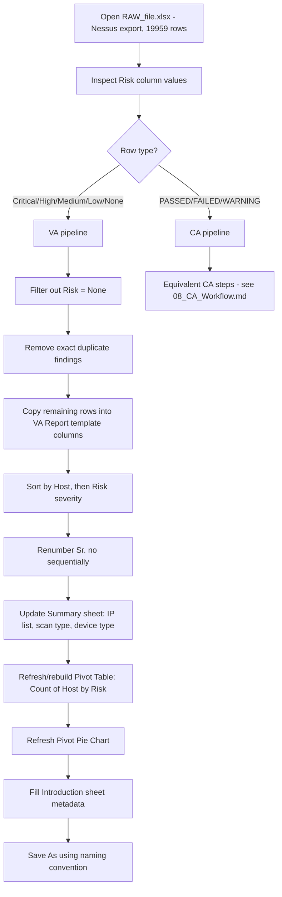

# 02 — Current (Manual) Workflow — Reverse Engineered

> **Method note:** This reconstruction is built from (a) frame-by-frame review of the supplied
> screen recording (`2026-07-08_12-19-38.mp4`, ~9 minutes, Excel desktop session), and (b) forensic
> analysis of the two supplied workbooks (`RAW_file.xlsx` and the final
> `VA_Server_First_Audit_Report...xlsx`), comparing raw row counts/values against the final
> report's row counts/values to infer the exact filtering and transformation logic. Where the
> video did not clearly show a discrete UI action (e.g., exact filter dialog values, exact
> dedup keys), the step is marked **[INFERRED]** and the underlying evidence is stated. Anything
> that could not be inferred with confidence is escalated to `13_Open_Questions.md` rather than
> guessed silently.

## High-Level Flow

## Step-by-Step Table

| Step | Manual Action | Purpose | Input | Output | Business Rule | Automation Candidate | Dependencies | Potential Edge Cases | Expected Result |
|---|---|---|---|---|---|---|---|---|---|
| 1 | Open `RAW_file.xlsx` (Nessus export) in Excel | Load raw scan data for review | Raw `.xlsx`, sheet `RAW File`, 19,959 rows × 17 columns | Open workbook in Excel session | Raw file is single-sheet, header row 1 | Yes — `openpyxl`/`pandas` read | File must exist and be readable `.xlsx` | Corrupt file, wrong sheet name, extra sheets, header not on row 1 | Data loaded into memory/grid |
| 2 | Visually scan the `Risk` column | Understand distribution of finding severities before filtering | Column D (`Risk`) | Mental model of counts (Critical/High/Medium/Low/None/PASSED/FAILED/WARNING) | Risk values are NOT limited to VA severities — CA-style `PASSED/FAILED/WARNING` values are present in the **same** raw export column | Yes — `value_counts()` on Risk column at ingestion, logged for QA | Step 1 | Unexpected/unknown Risk value (typo, new scanner label) | Analyst decides VA vs CA split |
| 3 | Filter/sort raw sheet by `Risk` (Excel AutoFilter / Sort) | Group similar rows together to ease manual review | `Risk` column | Rows grouped by severity value | **[INFERRED]** Standard Excel filter/sort workflow visible in recording; exact sort order not confirmed pixel-for-pixel | Yes — replace with a `groupby`/`sort_values` operation | Step 2 | Blank/null Risk values | Rows visually clustered by Risk |
| 4 | Exclude rows where `Risk = "None"` | `None`-risk rows are informational-only Nessus plugin output (e.g., NetBIOS name disclosure, traceroute) and are never included in a client-facing VA report | Filtered raw rows | Rows with `Risk` in `{Critical, High, Medium, Low}` only | **Business Rule:** VA report always excludes `Risk = None`. Confirmed by comparing raw counts (`None` = 5,262 rows) against final report (0 rows with no severity) | Yes — hard filter `Risk != "None"` for the VA pipeline | Step 3 | Case-sensitivity ("none" vs "None"), leading/trailing whitespace | ~14,697 candidate VA rows remain before further filtering |
| 5 | Separate CA-type rows (`PASSED`/`FAILED`/`WARNING`) from VA-type rows | The same raw export mixes two report types; they must be routed to two different templates/pipelines | Filtered raw rows | Two logical row sets: VA rows and CA rows | **[INFERRED]** Not directly observed as a discrete UI action, but structurally necessary — raw file contains 2,857 `FAILED`, 2,757 `PASSED`, 38 `WARNING` rows that cannot exist in the VA report's `Risk` column (which only ever contains Critical/High/Medium/Low in the sample final report) | Yes — a `row_type` classifier applied at ingestion | Step 4 | A row with an ambiguous/blank Risk value; scanner label drift | Two clean input sets for downstream pipelines |
| 6 | Identify and remove duplicate findings | Nessus frequently reports the same plugin/finding multiple times per host (e.g., re-tested ports, repeated banner grabs) | VA row set | De-duplicated VA row set | **Business Rule [INFERRED key]:** duplicate = same `Name` (Vulnerability Title) + `Description` + `Risk` + `Host`. Exact match on these 4 fields is treated as a duplicate and removed, keeping one instance | Yes — `drop_duplicates(subset=[Name, Description, Risk, Host])` | Step 5 | Two genuinely distinct findings that happen to share title/desc/host but differ only in Port/Plugin ID — current rule would incorrectly merge them (flagged in Open Questions) | Reduced, unique finding set |
| 7 | Copy cleaned rows into the `VA Report` sheet of the branded template | Move data from raw analytical view into the client-facing template | De-duplicated VA rows | Populated rows starting at template row 14 | Template header row is row 13: `Sr. no, Vulnerbility Title, Description, Risk, Host, Port, Recommendation, Reference, CVE` (note: template header has a typo, "Vulnerbility" — must be preserved exactly for visual fidelity) | Yes — column mapping (see `06_Data_Transformation.md`) | Step 6 | Column mismatch between raw headers and template headers (they are not identical — mapping required) | Data appears in template, unformatted borders/fonts inherited from template row styles |
| 8 | Map raw columns to template columns | Raw and template column names/order differ | Raw columns (`Name`, `Description`, `Risk`, `Host`, `Port`, `Solution`, `See Also`, `CVE`) | Template columns (`Vulnerbility Title`, `Description`, `Risk`, `Host`, `Port`, `Recommendation`, `Reference`, `CVE`) | See full mapping table in `06_Data_Transformation.md` | Yes | Step 7 | Raw `Solution` maps to template `Recommendation `; raw `See Also` maps to template `Reference` | Template columns fully populated |
| 9 | Sort populated rows | Present findings in a sensible reading order for the client | Populated, mapped rows | Reordered rows | **[INFERRED / partially contradicted by sample data]** The intended business rule (per client's own stated convention) is Host ascending, then Risk severity descending in order Critical > High > Medium > Low. The sample final report does **not** consistently follow this per-host (see `13_Open_Questions.md` — the sample appears to have IP addresses anonymized/renumbered which may have scrambled the visible grouping) | Yes — but sort key needs confirmation before hard-coding | Step 8 | Ties within same host/risk — secondary sort key unclear (Plugin ID order observed as a plausible tiebreaker) | Deterministic row order |
| 10 | Renumber the `Sr. no` column sequentially (1, 2, 3, …) | Every row must show a clean running number for the client, regardless of any filtering/dedup that happened upstream | Sorted rows | `Sr. no` column values 1..N | Business rule: `Sr. no` is a pure sequential integer with no gaps, regardless of original Plugin ID | Yes — `range(1, len(df)+1)` | Step 9 | Off-by-one error if header row miscounted | Clean 1..145 numbering in sample |
| 11 | Adjust row height / re-apply borders and font on each new row | Keep visual consistency as rows are added (template rows are tall — ~171pt — to accommodate wrapped long descriptions) | New data rows | Uniformly formatted rows | Font: Cambria 11pt data / Cambria 16pt bold header; thin borders all sides; wrap text on; row height auto/171pt | Yes — copy cell style object from a template "master row" for every new row | Step 10 | Extremely long description text overflowing even the tall row height | Visually uniform table, no unformatted rows |
| 12 | Build/refresh the "List of IPs in scope" table on the `Summary` sheet | Give the client a quick view of what was tested, with scan type (Authenticated/Unauthenticated) and device type (Server/Firewall/etc.) | Distinct Host values from VA rows + engagement knowledge of scan type/device type | Populated table at `Summary!A7:C26` (headers `IP Address / Scan Type / Device Type`) | Scan Type and Device Type are **not derivable from the raw Nessus export** — they are analyst knowledge entered manually per engagement | **[INFERRED — needs metadata input]** Cannot be automated without external input; must be supplied as engagement metadata (per-IP lookup table) | Step 9 (needs distinct Host list) | New host appears with no metadata mapping | Complete scope table |
| 13 | Build/refresh Pivot Table "Count of Host" grouped by `Risk` | Produce the numeric summary used for both the printed summary and the pie chart | Populated `VA Report` sheet | Pivot table (`Critical/High/Medium/Low/Grand Total` with counts) at `Summary!E18:F23` | Pivot source range must point at the **current** VA Report data range, not a stale/previous range | **[OBSERVED DEFECT in sample]** The sample workbook has a *second, older* pivot table at `Summary!E11:F16` (Grand Total 194) that does **not** match the current VA Report's total (145) — clear evidence that in the manual process old summary tables are sometimes left behind/not refreshed when the report is reused as a starting template for a new engagement | Yes — regenerate pivot from scratch every run; never reuse leftover data | Step 12 | Forgetting to refresh pivot after data changes (this is the exact defect observed) | Accurate counts matching the VA Report sheet |
| 14 | Refresh the Pivot Pie Chart bound to the pivot table | Visual severity-distribution chart for the summary page | Refreshed pivot table | Pie chart (`Summary!H8:P29` approx., anchored via `drawing2.xml` / `chart1.xml`, `pivotSource = Summary!PivotTable1`) | Chart type = pie chart (`<c:pieChart>`); colored by pivot field (Risk) | Yes — regenerate chart from the same pivot table each run (openpyxl chart or a pre-built chart object refreshed via win32/LibreOffice pivot refresh) | Step 13 | Chart categories not refreshing automatically when pivot source changes (common Excel pivot-chart pitfall) | Pie chart visually matches current risk distribution |
| 15 | Fill in `Introduction` sheet metadata | Static/legend page — same content every report except a few identity fields | N/A (template + engagement metadata) | `Introduction!B19` = Report owner; `Introduction!B14-15` = Scanner name/version | Report owner name and scanner version fields change per engagement; the "How to read the report" legend text (rows 3-10) is static | Yes — fill only the identified dynamic cells; never touch the legend text | Engagement metadata available | Wrong tester/reviewer name copied from a previous report | Correct, current metadata shown |
| 16 | Fill in `VA Report` header block (rows 5-10) | Client name, tester, reviewer, date, version, scanner | N/A (engagement metadata) | `VA Report!C5:C10` populated | `Client Name`, `Security Tester`, `Reviewed By`, `Report Date`, `Report Version`, `Scanner` labels are static in column B; values go in column C | Yes | Engagement metadata available | Stale date/version copied forward from a template reused across engagements | Correct header block |
| 17 | Save As with company naming convention | Deliverable file naming must follow a fixed pattern for internal tracking | Completed workbook | File saved to disk | See naming convention rule in `05_Business_Rules.md`: `<ReportType>_<Scope>_<Phase>_Audit_Report_<ClientName>_<EntityCodes>_<Year>_V<Version>.xlsx` | Yes — construct filename programmatically from metadata | Step 16 | Special characters in client name breaking filename; version number collision (overwrite) | Correctly named `.xlsx` deliverable |
| 18 | (Recording also shows repeated worksheet-tab switching between `RAW File`, `VA Report`, and `Summary`) | Cross-check data consistency between raw source and finished report while building it | All 3 sheets open simultaneously | N/A — verification only, no data change | **[OBSERVED]** Analyst repeatedly tabs back and forth, consistent with manual copy/paste-and-verify workflow rather than formula-linked sheets (i.e., `VA Report` values are **static pasted values**, not live formulas referencing `RAW File`) | N/A (automation replaces this entirely with a single deterministic pipeline) | All prior steps | Human error from manual cross-checking | Analyst confidence before saving |

## Notes on What the Video Confirms vs. What Is Inferred

- **Confirmed by direct file inspection** (does not depend on video interpretation):
  - Raw file structure and Risk-value distribution (Step 2, 4, 5).
  - Final report structure, headers, formatting, fonts, borders (Steps 7, 8, 11).
  - The stale/leftover pivot table defect (Step 13).
  - Chart type and pivot-chart binding (Step 14).
- **Inferred from the general shape of the recording** (an analyst working inside Excel across
  multiple sheets/tabs, using filter/sort/copy-paste patterns typical of this kind of report
  build): Steps 1, 3, 9, 18. These should be treated as the most likely reconstruction, not a
  guaranteed pixel-exact transcript of every click. See `13_Open_Questions.md` for what should
  be confirmed with the business owner before final implementation.
