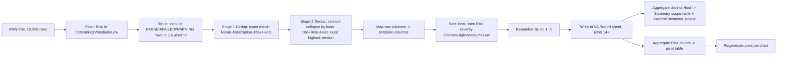

# 06 — Data Transformation

## Column Mapping: Raw File → `VA Report` Sheet

| Raw column (`RAW File`) | Template column (`VA Report`, row 13 header) | Transformation |
|---|---|---|
| *(computed)* | `Sr. no` | Sequential integer, 1..N, assigned **after** filtering, dedup, and sorting (not copied from raw `Plugin ID`) |
| `Name` | `Vulnerbility Title` *(preserve template's existing typo — do not "fix" it)* | Direct copy, no transformation |
| `Description` | `Description` | Direct copy, no transformation. Long text, relies on `wrap_text=True` + tall row height for display |
| `Risk` | `Risk` | Direct copy — values remain `Critical`/`High`/`Medium`/`Low` (rows with `None` already excluded upstream) |
| `Host` | `Host` | Direct copy. **Note:** production data will contain real IPs; the sample's `192.x.x.N` pattern is an anonymization artifact of the sample file only and must not be treated as a transformation rule |
| `Port` | `Port` | Direct copy (integer; `0` allowed for host-level findings) |
| `Solution` | `Recommendation ` *(preserve trailing space in header)* | Direct copy, no transformation |
| `See Also` | `Reference` | Direct copy. May be null (leave cell blank, not the string "None") |
| `CVE` | `CVE` | Direct copy. May be null. **Open question**: whether multiple CVEs in one raw cell need re-formatting (line breaks vs. comma list) — see `13_Open_Questions.md` |
| `Synopsis` | *(not used)* | Dropped — synopsis is not represented anywhere in the final template |
| `Plugin Output` | *(not used)* | **Dropped intentionally** — contains raw scanner evidence (file/share listings, credentials context) unsuitable for client deliverable |
| `Plugin ID` | *(not used in visible columns)* | Retained internally only as a stable dedup/audit key, not written to the visible report |
| `CVSS v2.0/v3.0/v4.0 Base Score`, `VPR Score`, `EPSS Score` | *(not used)* | Not present in the sample template. Retain internally in case a future report variant needs them — do not silently discard from the processing log |
| `Protocol` | *(not used)* | Not present in the sample template as its own column (protocol context is implicit in `Port`) |

## Derived Fields

| Field | Derivation |
|---|---|
| `Sr. no` | `range(1, len(final_df) + 1)` after all filtering/sorting is complete |
| Row grouping key (internal) | `Host` — used purely to order the output, not written as a separate column |
| Risk sort weight (internal) | `{"Critical": 0, "High": 1, "Medium": 2, "Low": 3}` — used purely to order the output, not written as a separate column |

## Lookup Logic

| Lookup | Source | Target |
|---|---|---|
| `Scan Type` per host (e.g., `Authenticated`) | External engagement metadata (must be supplied — not in raw file) | `Summary!C` column per matching `Host` in `Summary!A` |
| `Device Type` per host (e.g., `Server`, `Firewall`) | External engagement metadata (must be supplied — not in raw file) | `Summary!C` column per matching `Host` in `Summary!A` |

**No other lookups** (e.g., CVE-to-CVSS enrichment, plugin-to-category mapping) were observed in
the sample; scores already exist per-row in the raw file if ever needed.

## Merge Logic

- No row-level merges occur. Each output row in `VA Report` maps 1:1 to exactly one
  (post-dedup) raw row.
- The two `Summary` sheet pivot inputs (scope table and risk-count pivot) are **aggregations**,
  not merges, both computed from the final `VA Report` data — see below.

## Replacement / Cleaning Rules

| Rule | Detail |
|---|---|
| Trim leading/trailing whitespace on `Risk`, `Host`, `Name` before any filtering/dedup comparison | Prevents false negatives in filtering (`"None "` ≠ `"None"` otherwise) |
| Normalize `Risk` casing to title case for comparison (`"none"` → `"None"`) before filtering, while preserving the display value's original casing convention seen in the sample (`Critical`, `High`, `Medium`, `Low` — all title case) | Guards against inconsistent scanner export casing |
| Replace literal empty-string cells with true nulls (`None`/`NaN`) before writing, so that Excel shows a truly blank cell rather than an empty-string artifact | Matches observed blank cells in sample (`See Also` blank cells render as empty, not `"None"` text) |
| Do **not** alter the text of `Description`, `Solution`/`Recommendation`, or `See Also`/`Reference` content itself (no truncation, no re-wrapping logic beyond Excel's native `wrap_text`) | Sample shows full, unedited scanner text copied verbatim into the report |

## Deduplication (Detail) — CONFIRMED two-stage process

### Stage 1 — Exact dedup

```
dedup_key = (row.Name, row.Description, row.Risk, row.Host)
```

- Apply **after** the `Risk != "None"` filter, **before** sorting/renumbering.
- Keep the first occurrence per key (stable), drop subsequent duplicates.
- Log a count of rows removed by dedup for QA.

### Stage 2 — Version-collapse

Applied immediately after Stage 1, on the rows that survive it.

**Step A — Extract a version token from `Name`.**

Use a regex that captures a dotted numeric version string, optionally preceded by a comparison
qualifier, e.g.:

```
VERSION_PATTERN = r'(?:<=|<|=|version)?\s*(\d+(?:\.\d+){1,4})'
```

Apply this to `Name` and take the **last** matching numeric token in the string (titles in this
raw export follow the pattern `"<Product> <= <version> <Advisory text>"`, so the version is
typically the first/only dotted-number token; taking the last match is a safe default if a
title also contains a trailing build/CVE-like number).

**Step B — Compute a "base title" for grouping.**

```
base_title = re.sub(VERSION_PATTERN, '', row.Name).strip()
```

i.e., the title with the version substring removed, so that
`"Adobe Flash Player <= 32.0.0.387 Multiple Vulnerabilities (APSB19-53)"` and
`"Adobe Flash Player <= 32.0.0.390 Multiple Vulnerabilities (APSB19-53)"` both collapse to the
same `base_title`.

**Step C — Group and keep the newest version.**

```
group_key = (base_title, row.Risk, row.Host)
```

- Within each `group_key`, parse each row's extracted version token into a comparable tuple of
  integers (e.g. `"32.0.0.390"` → `(32, 0, 0, 390)`), padding shorter tuples with zeros for
  comparison (`"7.2"` → `(7, 2, 0, 0)` when compared against `(7, 2, 1, 0)`).
- Sort descending by this tuple; **keep only the top row**.
- **Drop all other rows in the group entirely** — do not merge their `CVE`, `Port`, or
  `Reference` values into the kept row (confirmed by business: older-version rows are simply
  discarded, not merged).
- Rows whose `Name` contains **no parsable version token** (e.g., advisory-code-only titles
  like `Fortinet Fortigate ... (FG-IR-25-756)`) are **not affected by Stage 2** — they pass
  through unchanged, since the confirmed business rule applies specifically to embedded version
  numbers, not advisory/date codes. Whether an analogous collapse rule should also apply to
  advisory-code titles is tracked as an open question (`13_Open_Questions.md`, Q4).

**Step D — Log.**

Record, per group with more than one member: the base title, host, number of versions found,
the version kept, and the versions dropped — this is essential for QA/auditability given this is
a data-discarding operation.

### Worked Example

| Name (raw) | Risk | Host | Extracted version | Base title | Kept? |
|---|---|---|---|---|---|
| `Adobe Flash Player <= 32.0.0.387 Multiple Vulnerabilities (APSB19-53)` | Critical | 10.1.1.5 | `32.0.0.387` | `Adobe Flash Player <= Multiple Vulnerabilities (APSB19-53)` | No — older |
| `Adobe Flash Player <= 32.0.0.390 Multiple Vulnerabilities (APSB19-53)` | Critical | 10.1.1.5 | `32.0.0.390` | `Adobe Flash Player <= Multiple Vulnerabilities (APSB19-53)` | **Yes — highest version** |
| `Fortinet Fortigate Format String Bug in cli command (FG-IR-23-137)` | High | 10.1.1.9 | *(none found)* | *(unchanged — no version token)* | Passes through unchanged, Stage 2 does not apply |

## Sorting / Ordering Pipeline — ✅ CONFIRMED

1. Group rows into contiguous blocks by `Host` (grouping order = ascending IP-numeric order,
   pending final confirmation — see `13_Open_Questions.md` Q11; the *within-block* order is now
   fully confirmed regardless of block order).
2. Within each host's block, order strictly by risk weight ascending
   (`{"Critical": 0, "High": 1, "Medium": 2, "Low": 3}`) — **confirmed by business**: "for one
   unique IP the list gets sorted Critical > High > Medium > Low, and similarly for the next set
   of IPs." This repeats independently for every host block in the output.
3. Within the same host + risk, preserve original raw row order (stable sort) as a tiebreaker.
4. Assign `Sr. no` sequentially over the fully sorted set.

## End-to-End Transformation Pipeline (VA)


