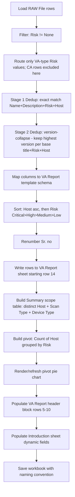

# 07 — Vulnerability Assessment (VA) Workflow

## Inputs

| Input | Detail |
|---|---|
| Raw scanner export | `RAW File` sheet, filtered to `Risk ∈ {Critical, High, Medium, Low, None}` rows |
| Report template | Clean copy of the branded 3-sheet workbook (`Introduction`, `VA Report`, `Summary`) |
| Engagement metadata | Client name, tester, reviewer, report date, report version, scanner name/version, per-host `Scan Type` and `Device Type` |

## Processing Pipeline



## Intermediate Datasets

| Stage | Dataset name (suggested) | Shape (sample) |
|---|---|---|
| 1 | `raw_df` | 19,958 rows × 17 columns |
| 2 | `va_candidates_df` (Risk != None) | ~14,696 rows (sample estimate: 19,958 − 5,262 `None`) |
| 3a | `va_exact_deduped_df` (Stage 1 output) | ≤ `va_candidates_df` row count |
| 3b | `va_version_collapsed_df` (Stage 2 output) | 145 rows (matches sample final report total) |
| 4 | `va_mapped_df` (template column names) | 145 rows × 9 columns |
| 5 | `va_sorted_df` (final order + Sr. no) | 145 rows × 9 columns, ready to write |
| 6 | `scope_df` (distinct hosts + metadata) | ~19–20 rows × 3 columns |
| 7 | `risk_summary_df` (pivot equivalent) | 5 rows (Critical/High/Medium/Low/Grand Total) × 2 columns |

## Filtering (Recap)

- Exclude `Risk = "None"`.
- Do not route `PASSED`/`FAILED`/`WARNING` rows into this pipeline (they belong to
  `08_CA_Workflow.md`).

## Deduplication (Recap)

**Stage 1 — Exact:** key `(Name, Description, Risk, Host)`, keep first occurrence, drop the
rest.

**Stage 2 — Version-collapse (CONFIRMED by business):** for rows surviving Stage 1, group by
`(base_title, Risk, Host)` where `base_title` = `Name` with the embedded numeric version token
stripped out. Within each group, keep only the row with the **highest parsed version number**
found in `Name`; drop all other rows in that group entirely (no merging of `CVE`/`Port`/
`Reference`). Rows whose `Name` has no parsable version token pass through unaffected.

See `06_Data_Transformation.md` for the full extraction/comparison algorithm and worked example,
and `13_Open_Questions.md` (Q4) for the remaining edge case (advisory-code-only titles, e.g.
Fortinet's `FG-IR-25-756` pattern, which are explicitly **out of scope** for this version-collapse
rule per the confirmed business answer).

## Sorting (Recap) — ✅ CONFIRMED

- Rows are grouped into contiguous blocks per `Host`. Within each host's block, rows are ordered
  strictly `Critical → High → Medium → Low` (weight `Critical`→0 ... `Low`→3), stable tiebreak on
  original row order. This is confirmed directly by the business and applies independently to
  every host block. See `05_Business_Rules.md` §4. The remaining open point is only the
  **order of the host blocks themselves** (first-seen vs. ascending IP order — `13_Open_Questions.md`
  Q11), not the within-block severity ordering, which is fully resolved.

## Formatting Rules Applied on Write

- Font: Cambria, 11pt, data rows; Cambria 16pt bold, header row (already present in template,
  reused not regenerated).
- Every written cell gets a thin border on all sides (matches sample).
- `wrap_text = True` on `Vulnerbility Title`, `Description`, `Recommendation `, `Reference`.
- Row height auto-fit or fixed ~171pt to accommodate wrapped text (match sample; verify visually
  post-write since Excel's true auto-fit behavior can differ from a fixed value written via
  `openpyxl`).
- Column widths fixed per `04_Report_Template_Analysis.md` table (should already be baked into
  the template and not need to be rewritten — automation should **not** re-set column widths per
  row, only confirm the template's existing widths are untouched).

## Summary Creation

1. `scope_df` = distinct `Host` values present in `va_sorted_df`, left-joined against externally
   supplied `Scan Type` / `Device Type` metadata (keyed by IP).
2. Write `scope_df` to `Summary!A8` downward (headers at `Summary!A7:C7` already exist in
   template and are not rewritten).
3. `risk_summary_df` = `va_sorted_df.groupby("Risk").size()`, reindexed in the order
   `Critical, High, Medium, Low`, with a `Grand Total` row appended.
4. Write as a **native Excel PivotTable** (preferred, for visual/behavioral fidelity — supports
   right-click "Refresh") sourced from the `VA Report!A13:I<last_row>` range, or as a static
   value table styled to match if native pivot generation is not feasible in the chosen library
   — this is an architecture decision, see `11_Project_Architecture.md`.
5. **Confirmed (2026-07-09):** the verified blank master template contains **no pre-existing
   pivot table or pivot cache** — the pivot must be created from scratch on every run, not
   refreshed. This still fully eliminates the stale-pivot defect observed in the earlier
   completed sample, since automation is never starting from a file that could already contain
   old pivot data — it always clones the verified-empty master.

## Chart Creation

1. Build a pie chart bound to the risk-count pivot table/range — confirmed created from
   scratch every run (blank master has no existing chart to refresh).
2. Categories: `Critical`, `High`, `Medium`, `Low` (skip categories with zero count? — **open
   question**, sample doesn't demonstrate a zero-count category).
3. Anchor location should match the earlier *completed sample's* chart position (`Summary`
   sheet, approx. columns H–P, rows 8–29) — the blank master itself has no chart to copy an
   anchor from, so this anchor position must be hard-coded/configured from the completed
   sample's coordinates rather than "reused" from an existing object.

## Final Export

- Populate `VA Report!C5:C10` (Client Name, Security Tester, Reviewed By, Report Date, Report
  Version, Scanner).
- Populate `Introduction!B14:B15` (Scanner Name, Scanner Signature Version) and `Introduction!B19`
  (Report owner).
- Save as a new `.xlsx` file using the naming convention in `05_Business_Rules.md` §11.

## Business Rules Applied (Cross-Reference)

See `05_Business_Rules.md` §§1–11, all of which apply to this pipeline except the CA-specific
notes in §1 and §3.

## Expected Output

A 3-sheet `.xlsx` workbook where:
- `VA Report!A14:I158` (or however many rows result) contains the final, sorted, deduplicated,
  renumbered findings.
- `Summary!A8:C<n>` contains the scope table.
- `Summary` contains exactly **one** current, accurate pivot table + pie chart (no stale
  leftovers).
- `Introduction` and `VA Report` header fields reflect the current engagement's metadata.
- Visual appearance (fonts, colors, borders, logo, layout) matches the sample template exactly.

---

## Appendix: Full Pipeline Pseudocode

This is a near-literal translation target for the coding agent. It assumes a `pandas` +
`openpyxl` style implementation (Option B from `11_Project_Architecture.md`: static aggregation
+ static pie chart for the Summary sheet). Function/variable names are suggestions, not
requirements — the *sequence and logic* is what must be preserved exactly.

```
FUNCTION run_va_pipeline(raw_file_path, blank_template_path, engagement_metadata, output_dir):

    # 1. INGEST -----------------------------------------------------------
    raw_df = load_excel(raw_file_path, sheet_name="RAW File")
    validate_schema(raw_df, expected_columns=[
        "Plugin ID", "CVE", "CVSS v2.0 Base Score", "Risk", "Host", "Protocol", "Port",
        "Name", "Synopsis", "Description", "Solution", "See Also", "Plugin Output",
        "CVSS v4.0 Base Score", "CVSS v3.0 Base Score", "VPR Score", "EPSS Score"
    ])
    raw_df["Risk"] = raw_df["Risk"].astype(str).str.strip()
    raw_df["Host"] = raw_df["Host"].astype(str).str.strip()
    raw_df["Name"] = raw_df["Name"].astype(str).str.strip()

    known_va_risks = {"Critical", "High", "Medium", "Low", "None"}
    known_ca_risks = {"PASSED", "FAILED", "WARNING"}
    unknown = raw_df[~raw_df["Risk"].isin(known_va_risks | known_ca_risks)]
    IF NOT unknown.empty:
        log_warning("Unknown Risk values encountered", unknown["Risk"].value_counts())

    # 2. FILTER + ROUTE (VA only) ------------------------------------------
    va_candidates = raw_df[raw_df["Risk"].isin({"Critical", "High", "Medium", "Low"})].copy()
    log_stage_count("raw_rows", len(raw_df))
    log_stage_count("va_candidates_after_none_and_ca_exclusion", len(va_candidates))

    # 3. STAGE 1 DEDUP: exact match ----------------------------------------
    va_stage1 = va_candidates.drop_duplicates(
        subset=["Name", "Description", "Risk", "Host"], keep="first"
    ).copy()
    log_stage_count("after_stage1_exact_dedup", len(va_stage1))

    # 4. STAGE 2 DEDUP: version-collapse -------------------------------------
    VERSION_PATTERN = r'(\d+(?:\.\d+){1,4})'   # dotted numeric version token

    FUNCTION extract_version(name_text):
        matches = regex_findall(VERSION_PATTERN, name_text)
        IF matches is empty: RETURN None
        RETURN last(matches)   # take the last matching token, per 06_Data_Transformation.md

    FUNCTION version_to_tuple(version_str):
        parts = version_str.split(".")
        nums = [int(p) for p in parts]
        WHILE length(nums) < 4:
            nums.append(0)               # zero-pad to 4 components for comparison
        RETURN tuple(nums)

    FUNCTION base_title(name_text):
        RETURN regex_sub(VERSION_PATTERN, "", name_text).strip()

    va_stage1["_version_raw"] = va_stage1["Name"].apply(extract_version)
    va_stage1["_base_title"] = va_stage1["Name"].apply(base_title)

    kept_rows = []
    dropped_log = []

    FOR (base_title_val, risk_val, host_val), group IN va_stage1.groupby(
            ["_base_title", "Risk", "Host"]):

        no_version_rows = group[group["_version_raw"].isnull()]
        versioned_rows  = group[group["_version_raw"].notnull()]

        # rows with no parsable version token pass through unaffected
        kept_rows.append(no_version_rows)

        IF versioned_rows.empty:
            CONTINUE

        IF len(versioned_rows) == 1:
            kept_rows.append(versioned_rows)
            CONTINUE

        versioned_rows["_version_tuple"] = versioned_rows["_version_raw"].apply(version_to_tuple)
        versioned_rows_sorted = versioned_rows.sort_values("_version_tuple", ascending=False)
        winner = versioned_rows_sorted.iloc[[0]]
        losers = versioned_rows_sorted.iloc[1:]

        kept_rows.append(winner)
        dropped_log.append({
            "base_title": base_title_val, "host": host_val, "risk": risk_val,
            "kept_version": winner["_version_raw"].iloc[0],
            "dropped_versions": list(losers["_version_raw"])
        })

    va_stage2 = concat(kept_rows).drop(columns=["_version_raw", "_base_title"])
    log_stage_count("after_stage2_version_collapse", len(va_stage2))
    log_version_collapse_details(dropped_log)

    # 5. MAP COLUMNS ----------------------------------------------------------
    va_mapped = DataFrame({
        "Vulnerbility Title": va_stage2["Name"],
        "Description":        va_stage2["Description"],
        "Risk":               va_stage2["Risk"],
        "Host":               va_stage2["Host"],
        "Port":               va_stage2["Port"],
        "Recommendation ":    va_stage2["Solution"],
        "Reference":          va_stage2["See Also"].fillna(None),
        "CVE":                va_stage2["CVE"].fillna(None),
    })

    # 6. SORT -------------------------------------------------------------------
    RISK_WEIGHT = {"Critical": 0, "High": 1, "Medium": 2, "Low": 3}
    va_mapped["_risk_weight"] = va_mapped["Risk"].map(RISK_WEIGHT)
    va_mapped["_host_order"]  = va_mapped["Host"].map(build_host_order(va_mapped["Host"]))
    # build_host_order(): assigns each distinct Host a stable rank —
    # see 13_Open_Questions.md Q11 for first-seen vs. ascending-IP choice; default: first-seen

    va_sorted = va_mapped.sort_values(
        by=["_host_order", "_risk_weight"], kind="stable"
    ).drop(columns=["_risk_weight", "_host_order"]).reset_index(drop=True)

    va_sorted.insert(0, "Sr. no", range(1, len(va_sorted) + 1))
    log_stage_count("final_va_rows", len(va_sorted))
    log_risk_breakdown(va_sorted["Risk"].value_counts())

    # 7. CLONE TEMPLATE -----------------------------------------------------------
    working_path = clone_file(blank_template_path, to=temp_staging_dir())
    workbook = open_workbook(working_path)   # openpyxl.load_workbook

    assert_template_is_pristine(workbook)    # fail loudly if rows/pivots unexpectedly present

    # 8. WRITE HEADER METADATA -------------------------------------------------------
    va_sheet = workbook["VA Report"]
    va_sheet["C5"]  = engagement_metadata.client_name
    va_sheet["C6"]  = engagement_metadata.security_tester
    va_sheet["C7"]  = engagement_metadata.reviewed_by
    va_sheet["C8"]  = engagement_metadata.report_date
    va_sheet["C9"]  = engagement_metadata.report_version
    va_sheet["C10"] = engagement_metadata.scanner_name

    intro_sheet = workbook["Introduction"]
    intro_sheet["B14"] = engagement_metadata.scanner_name OR "Nessus "     # default preserved
    intro_sheet["B15"] = engagement_metadata.scanner_version OR "10.11.4"  # default preserved
    intro_sheet["B19"] = engagement_metadata.report_owner

    # 9. WRITE DATA ROWS (clone style from a template master row) --------------------
    master_row_style = capture_row_style(va_sheet, row=14)  # style only, row is empty in blank master
    FOR i, row IN enumerate(va_sorted.itertuples()):
        excel_row = 14 + i
        write_row(va_sheet, excel_row, row, columns=["Sr. no","Vulnerbility Title","Description",
                  "Risk","Host","Port","Recommendation ","Reference","CVE"])
        apply_style(va_sheet, excel_row, master_row_style)   # font, border, wrap_text, row height

    # 10. SUMMARY: SCOPE TABLE -----------------------------------------------------
    distinct_hosts = va_sorted["Host"].unique()   # in the same host order used for sorting
    scope_df = build_scope_table(distinct_hosts, engagement_metadata.host_metadata_lookup)
    # host_metadata_lookup: dict[ip] -> {"scan_type": ..., "device_type": ...}

    summary_sheet = workbook["Summary"]
    FOR i, row IN enumerate(scope_df.itertuples()):
        excel_row = 8 + i
        summary_sheet.cell(row=excel_row, column=1, value=row.ip_address)
        summary_sheet.cell(row=excel_row, column=2, value=row.scan_type)
        summary_sheet.cell(row=excel_row, column=3, value=row.device_type)

    # 11. SUMMARY: RISK COUNT AGGREGATION + PIE CHART (created fresh, none exist in blank master)
    risk_counts = va_sorted["Risk"].value_counts().reindex(
        ["Critical", "High", "Medium", "Low"], fill_value=0
    )
    grand_total = risk_counts.sum()

    write_risk_summary_table(summary_sheet, risk_counts, grand_total,
                              anchor="approx E18")   # match completed-sample layout
    build_pie_chart(summary_sheet, risk_counts,
                     anchor="approx H8:P29",         # match completed-sample chart position
                     theme_colors=load_theme_accent_colors(workbook))

    # 12. SAVE ----------------------------------------------------------------------
    filename = build_filename(
        report_type="VA",
        scope=engagement_metadata.scope_label,          # e.g. "Server"
        phase=engagement_metadata.phase_label,           # e.g. "First"
        client_name=engagement_metadata.client_name,
        entity_codes=engagement_metadata.entity_codes,    # optional
        year=engagement_metadata.report_date.year,
        version=engagement_metadata.report_version
    )
    final_path = join(output_dir, filename)
    guard_against_overwrite(final_path)
    save_workbook(workbook, final_path)

    log_summary(final_path, stage_counts, dropped_log)
    RETURN final_path
```

### Key Helper Contracts (implement as named, testable functions)

| Helper | Contract |
|---|---|
| `validate_schema(df, expected_columns)` | Raise a specific error naming any missing/extra/renamed column |
| `extract_version(name_text)` | Returns the last dotted-numeric token in the string, or `None`. See `06_Data_Transformation.md` worked example |
| `version_to_tuple(version_str)` | Zero-pads to a fixed-length integer tuple for correct numeric (not string) comparison |
| `base_title(name_text)` | Strips the version token, used purely as a grouping key |
| `build_host_order(host_series)` | Returns a stable rank per distinct host — default first-seen order pending `13_Open_Questions.md` Q11 |
| `assert_template_is_pristine(workbook)` | Fails loudly if `VA Report` row 14+ or `Summary` row 8+ already contain data, or if a pivot table/chart already exists — protects against the stale-data defect pattern from `02_Current_Workflow.md` |
| `build_filename(...)` | Implements the naming convention exactly per `05_Business_Rules.md` §11, with filesystem-safe character sanitization |
| `guard_against_overwrite(path)` | Prompts/auto-increments rather than silently overwriting an existing report |

### Logging Contract (for QA/auditability, per `01_Project_Overview.md` non-functional goals)

At minimum, log these counts on every run, in this order:
```
raw_rows
va_candidates_after_none_and_ca_exclusion
after_stage1_exact_dedup
after_stage2_version_collapse   (+ full dropped_log detail: base_title, host, risk, kept_version, dropped_versions)
final_va_rows
risk_breakdown (Critical/High/Medium/Low counts)
distinct_host_count
output_file_path
```
