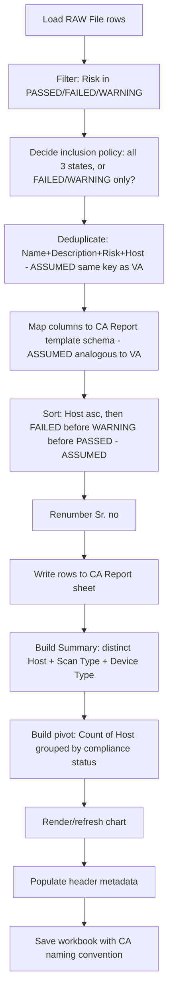

# 08 — Configuration Audit (CA) Workflow

> **IMPORTANT CAVEAT:** No sample **final CA report** workbook was supplied — only the raw
> export (which contains `PASSED`/`FAILED`/`WARNING` rows mixed in with the VA rows) and the
> final VA report were provided. Everything in this document below the "Evidence" section is
> therefore built **by analogy to the confirmed VA workflow**, not independently verified against
> a real CA output file. This entire document should be treated as a **draft specification
> requiring business sign-off** before implementation — every non-obvious choice is marked
> `[ASSUMED]` and is also logged in `13_Open_Questions.md`.

## Evidence (Confirmed From Raw File)

| Fact | Value |
|---|---|
| Rows with `Risk = "FAILED"` | 2,857 |
| Rows with `Risk = "PASSED"` | 2,757 |
| Rows with `Risk = "WARNING"` | 38 |
| Total CA-type rows in sample raw file | 5,652 |

These rows share the exact same 17-column schema as the VA rows (`Plugin ID`, `CVE`, CVSS
scores, `Risk`, `Host`, `Protocol`, `Port`, `Name`, `Synopsis`, `Description`, `Solution`, `See
Also`, `Plugin Output`, `VPR Score`, `EPSS Score`) — this is consistent with a Nessus
**compliance/configuration audit plugin** export (e.g., CIS benchmark checks), which Nessus
reports through the same finding schema as vulnerability plugins, just with `PASSED`/
`FAILED`/`WARNING` in place of a CVSS-derived severity.

## Inputs `[ASSUMED, by analogy to VA]`

| Input | Detail |
|---|---|
| Raw scanner export | Same `RAW File` sheet, filtered to `Risk ∈ {PASSED, FAILED, WARNING}` |
| Report template | A CA-specific branded template — **not supplied**. `[ASSUMED]` it mirrors the VA template's structure (Introduction / CA Report / Summary), with a CA-appropriate column set |
| Engagement metadata | Same category of fields as VA (client name, tester, reviewer, date, version, scanner) |

## Processing Pipeline `[ASSUMED]`



## Filtering `[ASSUMED — HIGH PRIORITY OPEN QUESTION]`

Two plausible interpretations, both defensible, that produce very different reports:

1. **Full compliance posture report**: include all three states (`PASSED`, `FAILED`,
   `WARNING`), giving the client a complete audit trail of every control checked, including
   ones they passed. This mirrors an ISO/CIS-style compliance report.
2. **Exceptions-only report**: include only `FAILED` (and possibly `WARNING`), analogous to how
   the VA pipeline excludes the "nothing wrong" state (`Risk = None`). Under this interpretation,
   `PASSED` is the CA equivalent of VA's `None` and should be dropped the same way.

**This must be confirmed with the business before implementation** — it materially changes both
report size and tone. See `13_Open_Questions.md`, Priority: High.

## Deduplication `[ASSUMED]`

Same 4-field key as VA: `(Name, Description, Risk, Host)`, pending confirmation that CA findings
don't have a more natural dedup key (e.g., a CIS control ID, if present in `Plugin ID` or
embedded in `Name`).

## Column Mapping `[ASSUMED, by analogy — needs a real CA template to confirm exact header text]`

| Raw column | Assumed CA report column |
|---|---|
| *(computed)* | `Sr. no` |
| `Name` | `Control / Check Title` |
| `Description` | `Description` |
| `Risk` | `Status` (`PASSED`/`FAILED`/`WARNING`) — **not** labeled "Risk", since these are compliance states, not severities `[ASSUMED — verify actual column header wording with business]` |
| `Host` | `Host` |
| `Port` | `Port` (may be less relevant for CA, often host-level only) |
| `Solution` | `Recommendation` |
| `See Also` | `Reference` |
| `CVE` | Likely not applicable to most CA/compliance checks (CIS benchmark items don't usually carry CVEs) — `[ASSUMED]` this column may not exist at all in a real CA template, or may be repurposed as a "Control ID" / benchmark reference column |

## Sorting `[ASSUMED]`

By analogy to VA's severity ordering, a natural compliance-status ordering would be:

```
FAILED  >  WARNING  >  PASSED
```
(most urgent finding first), grouped by `Host` as in the VA pipeline. This is a direct analogy,
not a confirmed rule.

## Summary / Chart `[ASSUMED]`

Same pattern as VA: a pivot table counting hosts/checks by `Status`, plus a pie or bar chart.
Whether the CA summary also needs a **pass rate percentage** (common in compliance reporting,
e.g., "82% of controls passed") is unknown — flagged as an open question since nothing in the
supplied evidence confirms or denies this.

## Naming Convention `[ASSUMED, by analogy]`

```
CA_<Scope>_<Phase>_Audit_Report_<ClientLegalName>_<EntityCode(s)>_<Year>_V<Major>.<Minor>
```
i.e., identical pattern to VA but with `CA` as the `ReportType` token, per `05_Business_Rules.md`
§11.

## Expected Output `[ASSUMED]`

A CA-equivalent 3-sheet workbook, structurally parallel to the VA report, once the filtering
policy and exact template layout are confirmed.

## Recommended Next Step Before Building This Pipeline

Obtain **one real, finished CA report sample** (equivalent to the VA sample provided) so this
document can be upgraded from `[ASSUMED]` to `CONFIRMED` status in the same way
`07_VA_Workflow.md` was built. Building the CA pipeline purely from this analogy carries real
risk of producing a report that does not match the business's actual expectations.
