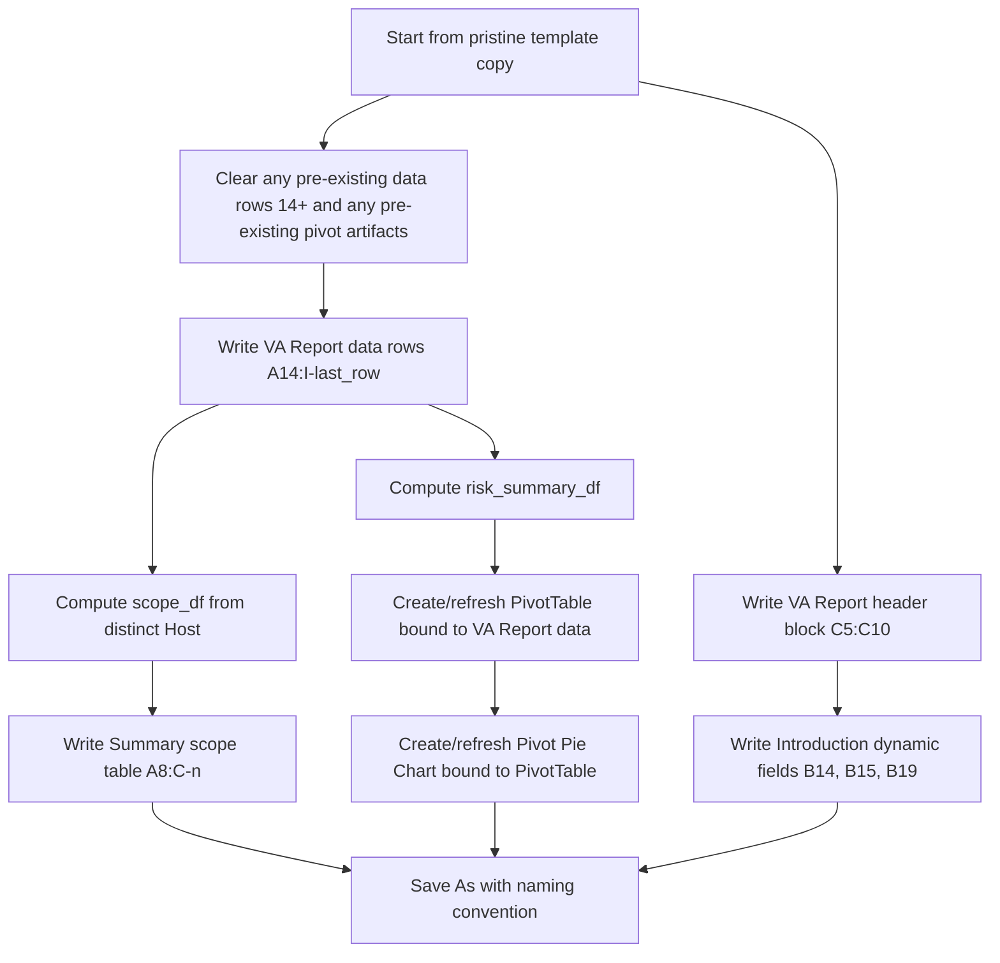

# 09 — Excel Template Mapping

This is the authoritative cell-range map the coding agent should use. Every range is classified
Static or Dynamic. **Dynamic ranges are the only ranges automation should ever write to.**
Static ranges must be copied through unmodified from the template.

## Workbook: `Introduction`

| Cell / Range | Purpose | Static/Dynamic | Input Source | Output Destination | Formatting Preserved? | Formula? | Chart Source? | Dependencies |
|---|---|---|---|---|---|---|---|---|
| A1 (merged A1:B1) | Title "Introduction" | Static | Template | — | Yes | No | No | None |
| A3:B10 | "How to read the Report" legend | Static | Template | — | Yes | No | No | None |
| A13 | "Security Scanner Details" heading | Static | Template | — | Yes | No | No | None |
| B14 | Scanner name value | **Dynamic (with default)** | Engagement metadata (`scanner_name`), defaults to `"Nessus "` if not overridden — confirmed pre-filled in the verified blank master template | `Introduction!B14` | Yes (reuse existing cell style) | No | No | Engagement metadata provided |
| B15 | Scanner signature version value | **Dynamic (with default)** | Engagement metadata (`scanner_version`), defaults to `"10.11.4"` if not overridden — confirmed pre-filled in the verified blank master template | `Introduction!B15` | Yes | No | No | Engagement metadata provided |
| A18 | "Security Testing Team" heading | Static | Template | — | Yes | No | No | None |
| B19 | Report owner name | **Dynamic** | Engagement metadata (`report_owner`) | `Introduction!B19` | Yes | No | No | Engagement metadata provided |
| A20 | Vendor company name | Static (unless business explicitly changes vendor per engagement) | Template | — | Yes | No | No | None |

## Workbook: `VA Report`

| Cell / Range | Purpose | Static/Dynamic | Input Source | Output Destination | Formatting Preserved? | Formula? | Chart Source? | Dependencies |
|---|---|---|---|---|---|---|---|---|
| I1:XFD3 (merged) | Logo image anchor | Static | Template (`xl/media/image1.png` via `drawing1.xml`) | — | Yes — do not touch drawing XML | No | No | None |
| B5 / C5 | "Client Name:" label / value | Label static, value **Dynamic** | Engagement metadata (`client_name`) | `VA Report!C5` | Yes | No | No | Engagement metadata provided |
| B6 / C6 | "Security Tester:" label / value | Label static, value **Dynamic** | Engagement metadata (`security_tester`) | `VA Report!C6` | Yes | No | No | " |
| B7 / C7 | "Reviewed By:" label / value | Label static, value **Dynamic** | Engagement metadata (`reviewed_by`) | `VA Report!C7` | Yes | No | No | " |
| B8 / C8 | "Report Date:" label / value | Label static, value **Dynamic** (Excel date type) | Engagement metadata (`report_date`) | `VA Report!C8` | Yes | No | No | " |
| B9 / C9 | "Report Version:" label / value | Label static, value **Dynamic** (float, e.g. `1.2`) | Engagement metadata (`report_version`) | `VA Report!C9` | Yes | No | No | " |
| B10 / C10 | "Scanner:" label / value | Label static, value **Dynamic** | Engagement metadata (`scanner_name`) | `VA Report!C10` | Yes | No | No | " |
| A13:I13 | Column headers (`Sr. no`, `Vulnerbility Title`, `Description`, `Risk`, `Host`, `Port`, `Recommendation `, `Reference`, `CVE`) | **Static — exact text, including typo/trailing space** | Template | — | Yes | No | No | None |
| A14:I<last_row> | Findings data table | **Fully Dynamic** | `va_sorted_df` (see `07_VA_Workflow.md`) | `VA Report!A14` downward, one row per record | Yes — clone header-row-adjacent style (Cambria 11, thin border, wrap text) onto every new row | No (values only, not formulas — matches manual "paste values" behavior) | No | Processed VA dataset ready |
| A<last_row+1>:I<end of used range from prior run> | Any leftover rows from a previous engagement's data, if writing into a reused (non-fresh) template copy | Must be **cleared**, not left in place | N/A | Clear cell contents + reset to blank-template row style, or simply always start from a pristine template copy | N/A | N/A | N/A | This directly prevents the stale-data defect pattern observed in the sample |

## Workbook: `Summary`

| Cell / Range | Purpose | Static/Dynamic | Input Source | Output Destination | Formatting Preserved? | Formula? | Chart Source? | Dependencies |
|---|---|---|---|---|---|---|---|---|
| O1:Q3 (approx.) | Logo image anchor (2nd placement) | Static | Template (`drawing2.xml`, `rId2`) | — | Yes | No | No | None |
| A5:C6 (merged) | "List of Ips in scope" heading | Static | Template | — | Yes | No | No | None |
| A7:C7 | Scope table headers (`IP Address`, `Scan Type`, `Device Type`) | Static | Template | — | Yes | No | No | None |
| A8:C<n> | Scope table data | **Dynamic** | `scope_df` (distinct hosts from `va_sorted_df` + external Scan Type/Device Type metadata) | `Summary!A8` downward | Yes — clone existing row style | No | No | `va_sorted_df`, engagement host metadata |
| J7:O7 (merged) | "Vulnerability Chart" heading | Static | Template | — | Yes | No | No | None |
| E11:F16 (only present as a leftover artifact in the earlier *completed* sample; **confirmed absent in the verified blank master template**) | **Do not reproduce.** No such range should ever be created by automation | N/A | N/A | N/A — nothing to write here | N/A | N/A | N/A | Fixes observed data-hygiene defect from the earlier sample; confirmed the blank master never had this artifact to begin with |
| Location TBD by pivot placement (anchor near `E18:F23` in the earlier completed sample; **does not exist yet in the blank master — must be created from scratch**) | Risk-count pivot table (`Row Labels` / `Count of Host`, rows `Critical/High/Medium/Low/Grand Total`) | **Dynamic — created fresh every run, not refreshed** (confirmed: the verified blank master template contains **zero** pivot tables/pivot caches) | `risk_summary_df` computed from `va_sorted_df` | Create a new native Excel PivotTable object bound to `VA Report!A13:I<last_row>` (or an equivalent value range if native pivot isn't used — see `11_Project_Architecture.md`), positioned to match the completed sample's layout (`Row Labels`/`Count of Host`) | Match sample style (`Row Labels`/`Count of Host` header text, bold/plain per sample) | Pivot formula-driven internally by Excel once created | **Yes — this is the chart's data source** | `va_sorted_df` |
| Anchor position to match the completed sample (approx. `H8:P29`, matching `drawing2.xml`'s graphicFrame anchor) — **chart itself does not exist in the blank master and must be created** | Pivot pie chart | **Dynamic — created fresh every run** (confirmed absent from blank master; only the two logo drawings exist there) | Bound to the newly created pivot table above | Create at the same anchor location as the completed sample | Style/theme colors should match the completed sample's chart (theme-accent-ordered, per `04_Report_Template_Analysis.md`) since there is no existing chart object to inherit style from | N/A (chart object, created new) | Yes — sourced from pivot table | Risk-count pivot table must exist first |

## Write-Order Dependency Graph

## Ranges the Coding Agent Must Never Touch

- `Introduction!A1:B10`, `A13`, `A18`, `A20`
- `VA Report!I1:XFD3` (logo anchor) and `A13:I13` (header text)
- `Summary!A5:C6`, `A7:C7`, `J7:O7`, and both logo/drawing anchors
- All font/fill/border style definitions inherited from the template's existing styles table —
  automation should **reuse existing style indices** wherever possible (copy a template "master"
  row's style onto new rows) rather than defining new styles, to guarantee pixel-level
  consistency.
