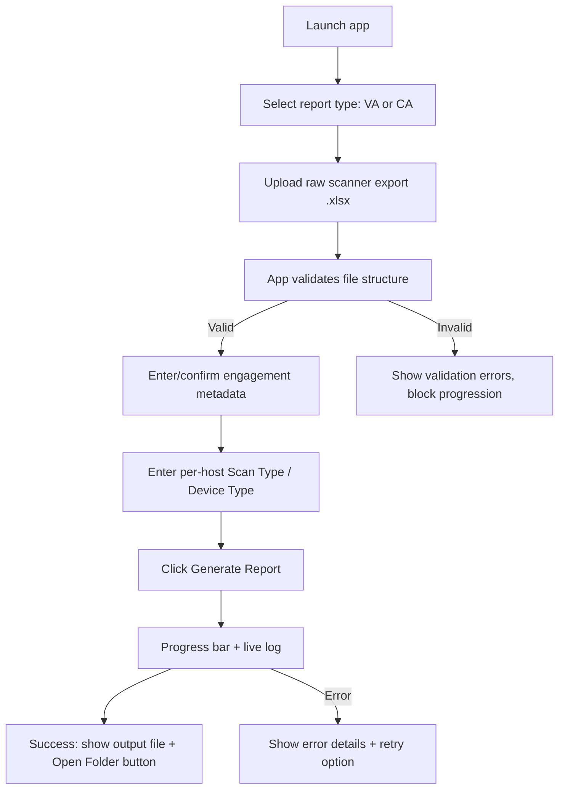

# 10 — UI Requirements (Optional Desktop Application)

> **Build-sequencing note (2026-07-09):** ✅ **Deferred.** Per business direction, implementation
> is proceeding **core pipeline functions first**; this document is **not part of the current
> build phase**. It is retained as a fully-specified fast-follow backlog so the UI can be built
> against a stable, already-tested pipeline once the VA pipeline (see `07_VA_Workflow.md`,
> `11_Project_Architecture.md`) is functionally complete. Nothing below should be implemented
> until that milestone is reached. This resolves `13_Open_Questions.md` Q12.

> This document specifies UI/UX requirements **if** a desktop application wrapper is built
> around the Python automation pipeline. If the tool will instead be a CLI/script only, this
> document can be treated as a future-phase backlog rather than a v1 requirement — flagged for
> the business to decide (see `13_Open_Questions.md`).

## Overall Workflow

## Screens / Steps

### 1. Report Type Selection
- Buttons/toggle: **Vulnerability Assessment (VA)** / **Configuration Audit (CA)**.
- Determines which filtering/mapping pipeline (§07 or §08) is applied.

### 2. Upload Process
- Drag-and-drop or file-picker for the raw `.xlsx` export.
- Immediate client-side validation:
  - File extension is `.xlsx`.
  - Sheet named `RAW File` exists.
  - Header row matches the expected 17-column schema (`03_Input_Files.md`).
- On failure, show a clear, specific error (e.g., *"Expected sheet 'RAW File' but found:
  Sheet1, Data"*) rather than a generic failure message.
- Optional: allow selecting/uploading a specific **template file** if the tool is meant to
  support multiple client-branded templates (extensibility goal from `11_Project_Architecture.md`).

### 3. Engagement Metadata Form
| Field | Type | Required |
|---|---|---|
| Client Name | Text | Yes |
| Security Tester | Text | Yes |
| Reviewed By | Text | Yes |
| Report Date | Date picker | Yes |
| Report Version | Text/number (e.g. `1.2`) | Yes |
| Scanner Name | Text (default `Nessus`) | Yes |
| Scanner Signature Version | Text | Yes |
| Report Owner | Text | Yes |
| Scope label (for filename, e.g. `Server`) | Text/dropdown | Yes |
| Phase label (for filename, e.g. `First`) | Text/dropdown | Yes |
| Entity Code(s) (for filename) | Text | Optional |

### 4. Per-Host Metadata Table
- Auto-populated with the **distinct hosts** detected in the uploaded raw file (post-filter).
- Editable grid: `IP Address` (read-only) | `Scan Type` (dropdown: Authenticated /
  Unauthenticated) | `Device Type` (dropdown: Server / Firewall / Network / Workstation / Other).
- Support "apply to all" bulk-fill for Scan Type/Device Type to reduce repetitive entry when most
  hosts share the same scan type.
- Warn (non-blocking) if any host is left unmapped before generation.

### 5. Buttons

| Button | Behavior |
|---|---|
| **Generate Report** | Triggers the full pipeline (§07/§08). Disabled until required metadata is complete. |
| **Cancel / Back** | Returns to previous step without losing entered data. |
| **Open Output Folder** | Opens the OS file explorer at the output file's location (post-success). |
| **View Log** | Expands/opens the processing log (filtering counts, dedup counts, warnings). |
| **Retry** | Re-runs generation after a failure, without re-uploading the file. |

### 6. Progress Bar / Log

- Progress bar stages should mirror the pipeline stages, e.g.:
  1. Validating input (0–10%)
  2. Filtering & routing rows (10–25%)
  3. Deduplicating (25–35%)
  4. Mapping & sorting (35–55%)
  5. Writing report data (55–75%)
  6. Building summary & chart (75–90%)
  7. Saving file (90–100%)
- Live log pane should show row counts at each stage (e.g., *"19,958 raw rows → 14,696 after
  Risk filter → 145 after dedup"*) for transparency and QA, matching the auditability
  non-functional goal in `01_Project_Overview.md`.

### 7. Error Handling

| Error class | UI behavior |
|---|---|
| Missing/invalid raw file schema | Block at upload step, specific column/sheet mismatch message |
| Unknown `Risk` value encountered | Non-blocking warning listing the unexpected values and row count, allow user to proceed (values excluded from both pipelines) or abort |
| Missing engagement metadata field | Inline field-level validation, block Generate button |
| Host present in data but missing Scan Type/Device Type | Non-blocking warning, allow proceeding with blank cells in Summary table (matches template's tolerance for manual entry) |
| Write/save failure (e.g., output path not writable, file open elsewhere) | Blocking error dialog with retry |
| Template file structural mismatch (missing expected sheet/range) | Blocking error, since visual fidelity cannot be guaranteed |

### 8. Output Folder / File Handling

- Default output location: a configurable "Reports Output" folder (see Settings).
- Auto-generate filename per the naming convention (`05_Business_Rules.md` §11), with an
  editable preview field so the user can review/adjust before saving.
- Prevent silent overwrite of an existing file with the same name — prompt for confirmation or
  auto-increment version.

### 9. Settings / Configuration

| Setting | Purpose |
|---|---|
| Default output folder | Where generated reports are saved |
| Default template file path (per report type, and optionally per client) | Supports the extensibility goal of multiple templates |
| Default vendor/consultant identity (e.g., "Secunatix Consultants Private Limited") | Avoid re-typing every engagement |
| Dedup key configuration (advanced) | Exposes the dedup fields from `06_Data_Transformation.md` for power users, since this rule is currently `INFERRED` and may need tuning |
| CA inclusion policy (all statuses vs. exceptions-only) | Exposes the open policy decision from `08_CA_Workflow.md` |

## Non-Functional UI Requirements

- The app must never let the user manually edit generated report cells within the app itself
  (edits should happen in Excel post-generation, not create a second source of truth in the UI).
- All validation errors must be specific and actionable, not generic "something went wrong"
  messages, to support the auditability goal.
